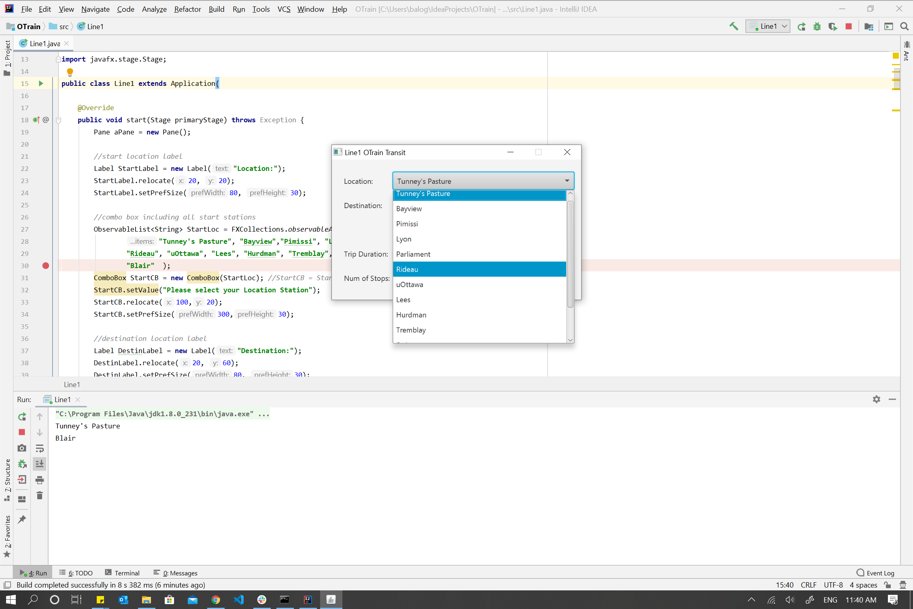

# OtrainLine1JavaFxGUIApplication
A transit GUI app for getting from East to West or West to East in Ottawa, ON. Was developed using javafx  and andriod studios.

# Demo
# Default stage of GUIApplication

# Train station location selection stage of GUIApplication

# Location and destination stations selected 

# Result output to User

